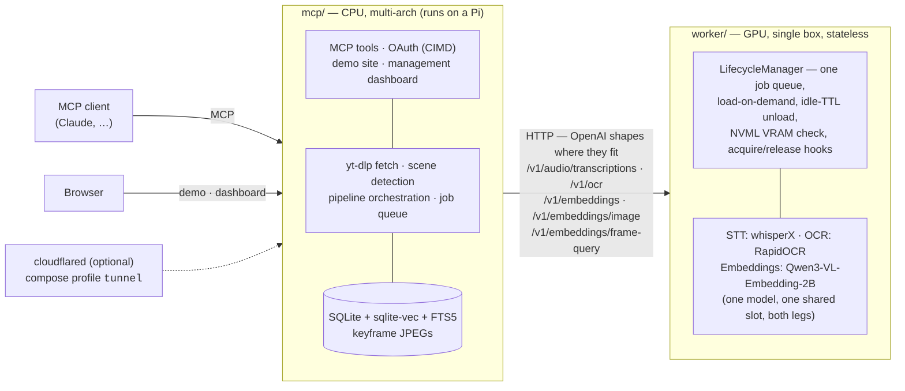

# vidtheque

Self-hosted MCP server that turns videos you've watched into a searchable
multimodal corpus — transcript, on-screen text, and frame search with
timestamped citations.

Point it at a video, a channel, or a playlist; it transcribes with word-level
timestamps, OCRs what is on screen, embeds keyframes, and keeps the whole thing
in a local index. Your MCP client then searches across everything you have ever
indexed and cites answers with deep links that land on the exact second
(`https://youtu.be/ID?t=123`). A built-in web demo and a management dashboard
ride in the same process: search and ask for visitors, a browsable index —
videos, shot timelines, OCR overlays, provenance, live jobs — for the operator.

> **Early development.** Working end to end — the pipeline, the MCP tool
> surface, the demo site and the dashboard are all functional and tested — but
> there are no releases and no published images yet, and schemas can still
> change without notice.

## Architecture

Two services, one repo, HTTP between them — never a shared Python import.



The worker is a **stateless inference API**. No GPU? Skip the worker service
entirely and point `WORKER_URL` at any OpenAI-compatible provider — the
endpoints are the contract, not the implementation.

Transcripts, metadata, OCR text *and* keyframes are embedded by one model:
`Qwen3-VL-Embedding-2B` (Apache-2.0, 2048 dims), which reads a slide or a
terminal as a document rather than as a picture — the axis where a CLIP-style
dual encoder measures 1.3–3.6× worse, and this corpus is conference talks. It
serves both legs from one loaded checkpoint in one lifecycle slot, so a cold
search pays one model load instead of two. `Qwen3-Embedding-0.6B` (1024 dims)
and `SigLIP 2 NaFlex so400m` (1152 dims) remain selectable for a smaller card;
that configuration is genuinely two spaces, never mixed — which is why text and
frame embeddings never share an endpoint under either arrangement.

## Quickstart

```bash
git clone https://github.com/T0mSIlver/vidtheque.git
cd vidtheque/deploy
cp .env.example .env      # read it: every knob is documented there
docker compose up -d      # mcp + worker
```

With a Cloudflare tunnel for remote access (read `docs/deploy-public.md`
first — going public is a checklist, and the security audit is the gate):

```bash
TUNNEL_TOKEN=… docker compose --profile tunnel up -d
```

Check the worker:

```bash
curl localhost:8081/healthz
curl localhost:8081/status     # loaded models, VRAM, queue depth
```

## Development

Requires [uv](https://docs.astral.sh/uv/) and Python 3.12.

```bash
uv sync            # workspace: mcp + worker + dev tools (CPU-only deps)
make test          # pytest, CPU-only, no model downloads
make bench         # backend-vs-backend comparisons on your own hardware
```

Heavy inference dependencies live in the worker's `[gpu]` extra, so CI and a
laptop checkout install cleanly without CUDA:

```bash
uv sync --extra gpu     # whisperX, transformers, RapidOCR
```

## Layout

| Path                 | What                                                              |
| -------------------- | ----------------------------------------------------------------- |
| `mcp/`               | MCP server, indexing pipeline, demo site, management dashboard    |
| `worker/`            | GPU inference worker: FastAPI + backend registry + lifecycle      |
| `deploy/`            | docker-compose, `.env.example`, tunnel wiring, go-public runbook  |
| `bench/`             | benchmark harness — backend comparisons on real hardware          |
| `docs/design/`       | the contracts: tool surface, index schema, demo site, dashboard   |
| `research/`          | the evidence behind the contracts (append-only working notes)     |

## License

MIT — see [LICENSE](LICENSE).
