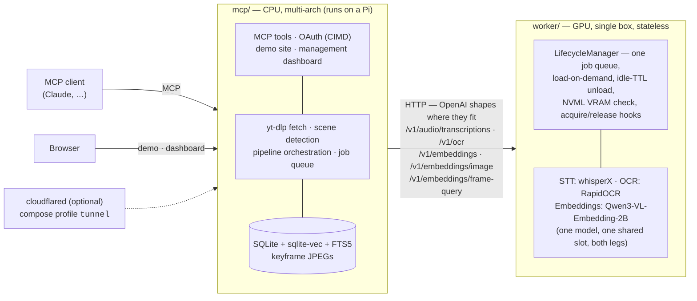

# vidtheque

Knowledge is announced on video. vidtheque puts it on tap.

**You don't have time to watch everything — your agent does.** Follow the
builders whose talks, streams and deep-dives matter: vidtheque turns them into
solid, timestamped knowledge for you and your agents — every sentence spoken,
every line that crossed the screen, every frame — and every answer comes with
its receipt: the sentence, the slide, and the second it happened
(`https://youtu.be/ID?t=123`).

Point it at a video, a channel, or a playlist; it transcribes with word-level
timestamps, reads what is on screen, embeds keyframes, and keeps the whole
thing in a local index you own. Self-hosted; your agents plug in over MCP. A
built-in web demo and a management dashboard ride in the same process: search
and ask for visitors, a browsable index — videos, shot timelines, OCR
overlays, provenance, live jobs — for the operator.

> **Early development.** Working end to end — the pipeline, the MCP tool
> surface, the demo site and the dashboard are all functional and tested — but
> there are no releases and no published images yet, and schemas can still
> change without notice.

## Architecture

Two services, one repo, HTTP between them — never a shared Python import.



The worker is a **stateless inference API** — the endpoints are the contract,
not the implementation. No GPU? Pointing `WORKER_URL` at a hosted
OpenAI-compatible provider covers the **transcript leg**, both indexing and
query side, on the standard `/v1/embeddings`. It does not cover frame search or
on-screen text: those need `/v1/embeddings/image`,
`/v1/embeddings/frame-query` and `/v1/ocr` at the same base URL, and no ordinary
provider serves them. Run the worker for the whole product, or a shim that
answers all five paths.

Transcripts, metadata, OCR text *and* keyframes are embedded by one model:
`Qwen3-VL-Embedding-2B` (Apache-2.0, 2048 dims), which reads a slide or a
terminal as a document rather than as a picture — the axis where a CLIP-style
dual encoder measures 1.3–3.6× worse, and this corpus is conference talks. It
serves both legs from one loaded checkpoint in one lifecycle slot, so a cold
search pays one model load instead of two. `Qwen3-Embedding-0.6B` (1024 dims)
and `SigLIP 2 NaFlex so400m` (1152 dims) remain selectable for a smaller card;
that configuration is genuinely two spaces, never mixed — which is why text and
frame embeddings never share an endpoint under either arrangement.

## Quickstart

```bash
git clone https://github.com/T0mSIlver/vidtheque.git
cd vidtheque
cp deploy/.env.example deploy/.env
```

[`deploy/.env.example`](deploy/.env.example) is the document of record for every
environment variable — 48 KB of what each knob does and what it costs. It is
worth the read before the first `up`.

**Private, on your own network** — the reference deployment:

```bash
docker compose -f deploy/docker-compose.yml up -d      # mcp + worker
```

**Public, behind a Cloudflare tunnel** — the overlay is not optional:

```bash
# in deploy/.env, at least: VIDTHEQUE_PUBLIC_READONLY=1  VIDTHEQUE_AUTH=none
#                           VIDTHEQUE_PUBLIC_HOSTNAME=…  PUBLIC_URL=https://…
TUNNEL_TOKEN=… docker compose \
    -f deploy/docker-compose.yml \
    -f deploy/compose.public.example.yml \
    --profile tunnel up -d
```

Run the tunnel profile *without* `compose.public.example.yml` and the base file
hands the container four variables by name and nothing else — `deploy/.env` is
compose's interpolation source, not the container's environment — so
`VIDTHEQUE_PUBLIC_READONLY` and `VIDTHEQUE_AUTH` are read by nobody: the server
comes up in **full read-write mode, with the write tools registered, on
`0.0.0.0`, behind a public hostname**. The overlay closes that and binds the
published ports to loopback so the tunnel is the only way in.

Read [`docs/deploy-public.md`](docs/deploy-public.md) before you open a tunnel:
going public is a checklist, the security audit is the gate, and thirty seconds
of `curl http://127.0.0.1:8080/api/meta | jq .auth` is the difference between a
demo and an open indexing service.

Check the worker:

```bash
curl localhost:8081/healthz
curl localhost:8081/status     # loaded models, VRAM, queue depth
```

## Development

Requires [uv](https://docs.astral.sh/uv/) and Python 3.12.

```bash
uv sync            # workspace: mcp + worker + dev tools (CPU-only deps)
make test          # pytest, CPU-only, no model downloads
make bench         # backend-vs-backend comparisons on your own hardware
```

Heavy inference dependencies live in the worker's `[gpu]` extra, so CI and a
laptop checkout install cleanly without CUDA:

```bash
uv sync --extra gpu     # whisperX, transformers, RapidOCR
```

## Layout

| Path                 | What                                                              |
| -------------------- | ----------------------------------------------------------------- |
| `mcp/`               | MCP server, indexing pipeline, demo site, management dashboard    |
| `worker/`            | GPU inference worker: FastAPI + backend registry + lifecycle      |
| `deploy/`            | docker-compose, `.env.example`, tunnel wiring, go-public runbook  |
| `bench/`             | benchmark harness — backend comparisons on real hardware          |
| `docs/design/`       | the contracts: tool surface, index schema, demo site, dashboard   |
| `docs/security.md`   | where the security material lives, public and private             |
| `research/`          | the evidence behind the contracts (append-only working notes)     |

## License

MIT — see [LICENSE](LICENSE).
