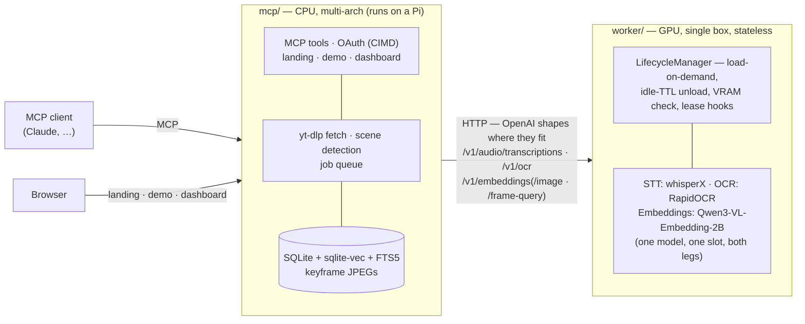

# vidtheque

Knowledge is announced on video. vidtheque puts it on tap.

**You don't have time to watch everything — your agent does.** Follow the
builders whose talks, streams and deep-dives matter: vidtheque turns them into
solid, timestamped knowledge — every sentence spoken, every line that crossed
the screen, every frame — and every answer comes with its receipt: the
sentence, the slide, and the second it happened (`https://youtu.be/ID?t=123`).

> screenpipe is AI powered by everything *you've* seen, said, or heard.
> vidtheque is AI powered by what you *didn't have time* to see — from the
> people worth listening to.

**See it live:** [vidtheque.dev](https://vidtheque.dev) — and
[vidtheque.dev/demo](https://vidtheque.dev/demo), the first shelf: every AI
Engineer 2026 talk, on tap. (The reference instance, self-hosted on the
maintainer's own box.)

> **Early development.** Working end to end and tested, but no releases, no
> published images, and schemas can still change without notice.

## Quickstart

```bash
git clone https://github.com/T0mSIlver/vidtheque.git && cd vidtheque
cp deploy/.env.example deploy/.env   # the document of record for every knob
docker compose -f deploy/docker-compose.yml up -d      # private: mcp + worker
curl localhost:8081/healthz && curl localhost:8081/status
```

Going **public** is different: the tunnel overlay is not optional. Without
`compose.public.example.yml`, `deploy/.env` is compose's interpolation source,
not the container's environment — the server would come up read-write on
`0.0.0.0` behind a public hostname. Read
[`docs/deploy-public.md`](docs/deploy-public.md) before you open a tunnel;
going public is a checklist and the security audit is the gate.

## Follow the builders

Point it at a video, a channel, or a playlist. It transcribes with word-level
timestamps, reads what is on screen, embeds keyframes, and keeps it all in a
local index you own. The corpus is the channels you chose, growing by
subscription — the demo is the first shelf, not the library.

## Your agent watched it

Agents plug in over MCP and consume the corpus mid-task: ask for the SOTA,
get what was said on stage three weeks ago — search across transcript,
on-screen text and frames, then drill into any moment. A web demo and a
management dashboard ride in the same process: `/` is the landing, `/demo`
searches and answers for visitors, `/dashboard` is the operator's instrument.

## Receipts, always

What separates injected knowledge from a hallucinated summary: the verbatim
quote, the real slide with its OCR box, and the `youtu.be/…?t=` link that
lands on the second.

## Architecture

Two services, one repo, HTTP between them — never a shared Python import.



The worker is a **stateless inference API** — the endpoints are the contract.
A hosted OpenAI-compatible provider can cover the transcript leg; frame search
and OCR need the worker's sibling endpoints. One model embeds everything:
`Qwen3-VL-Embedding-2B` reads a slide as a document, not a picture — the axis
where CLIP-style dual encoders measure 1.3–3.6× worse on conference talks.

## Development

```bash
uv sync && make test    # CPU-only, no model downloads; GPU extras: --extra gpu
```

`AGENTS.md` is how to work in this repo; `docs/README.md` maps every surface
to its owning contract in `docs/design/`. `research/` is the append-only
evidence; `docs/history/` is the launch, as it happened. Security:
[`SECURITY.md`](SECURITY.md) + [`docs/security.md`](docs/security.md).

MIT — see [LICENSE](LICENSE).
