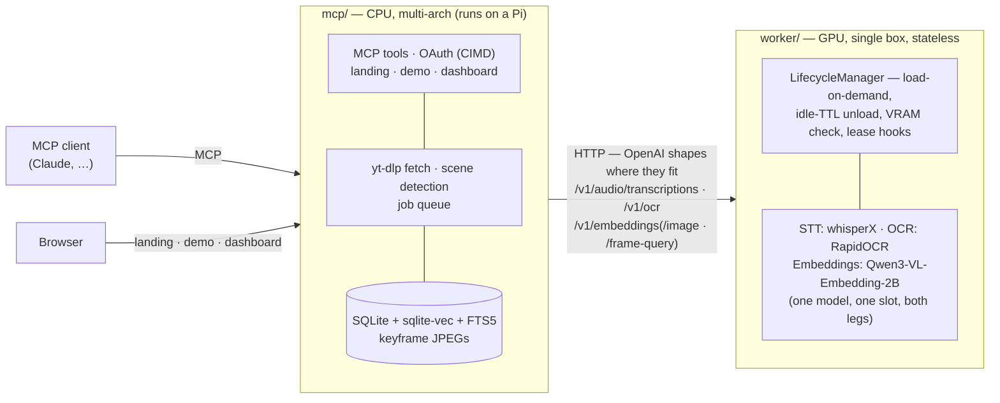

<picture>
  <source media="(prefers-color-scheme: dark)" srcset="https://raw.githubusercontent.com/T0mSIlver/vidtheque/main/docs/assets/wordmark-dark.svg">
  
</picture>

Knowledge is announced on video. vidtheque puts it on tap.

**You don't have time to watch everything — your agent does.** Follow the
builders whose talks, streams and deep-dives matter: vidtheque turns them into
solid, timestamped knowledge — every sentence spoken, every line that crossed
the screen, every frame — and every answer comes with its receipt: the
sentence, the slide, and the second it happened (`https://youtu.be/ID?t=123`).

**See it live:** [vidtheque.dev](https://vidtheque.dev) · [the demo](https://vidtheque.dev/demo)
— the first shelf: every talk AI Engineer published in 2026, all 310, on tap.

## Quickstart

Releases ship as published images — `ghcr.io/t0msilver/vidtheque-{mcp,worker}`:

```bash
mkdir vidtheque && cd vidtheque
REL=https://raw.githubusercontent.com/T0mSIlver/vidtheque/v0.0.6/deploy
curl -fsSLO "$REL/docker-compose.yml" -O "$REL/compose.release.example.yml"
curl -fsSL -o .env "$REL/.env.example"   # the document of record for every knob
echo "IMAGE_TAG=0.0.6" >> .env
docker compose -f docker-compose.yml -f compose.release.example.yml up -d
curl localhost:8080/healthz
```

The worker image is amd64 + CUDA (~28 GB — what GPU torch genuinely weighs);
the mcp image is CPU-only, multi-arch, and runs on a Pi. No GPU? Drop the
worker: a hosted OpenAI-compatible provider covers the transcript leg, and
YouTube captions are the zero-GPU indexing path. `deploy/vidtheque-update.sh`
makes upgrades one command; pin exact tags — `v0.0.x` schemas can still
change. To build from source instead: clone this repo, `cp deploy/.env.example
deploy/.env`, then `docker compose -f deploy/docker-compose.yml up -d`.

## Follow the builders

Point it at a video, a channel, or a playlist. It transcribes with word-level
timestamps, reads what is on screen, embeds keyframes, and keeps it all in a
local index you own — the channels you chose, growing by subscription. The
demo is the first shelf, not the library.

## Your agent watched it

Agents plug in over MCP and consume the corpus mid-task: ask for the SOTA,
get what was said on stage three weeks ago — search across transcript,
on-screen text and frames, then drill into any moment. A web demo and a
management dashboard sit over the same corpus on one origin: `/` is the
landing, `/demo` searches and answers for visitors, `/dashboard` is the
operator's instrument.

## Receipts, always

What separates injected knowledge from a hallucinated summary: the verbatim
quote, the real slide with its OCR box, and the `youtu.be/…?t=` link that
lands on the second.

## Architecture

Two services, one repo, HTTP between them — never a shared Python import.



The worker is a **stateless inference API** — the endpoints are the contract.
One model embeds everything: `Qwen3-VL-Embedding-2B` reads a slide as a
document, not a picture — where CLIP-style dual encoders do 1.3–3.6× worse.

## Development

```bash
uv sync && make test    # CPU-only, no model downloads; GPU extras: --extra gpu
```

`AGENTS.md` is how to work in this repo; `docs/README.md` maps every surface
to its contract. Security: [`SECURITY.md`](SECURITY.md) +
[`docs/security.md`](docs/security.md). MIT — see [LICENSE](LICENSE).
